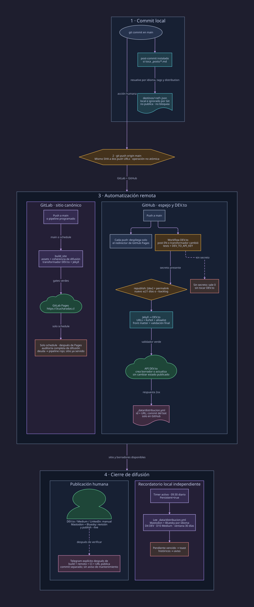

# Flujo de difusión después de cerrar un post

Fecha de revisión: 2026-09-06.

<picture>
  <source media="(max-width: 640px)" srcset="diagrams/flujo-difusion-mobile.svg">
  
</picture>

La fuente mantenible está en `docs/diagrams/flujo-difusion.d2`; la variante
vertical está en `docs/diagrams/flujo-difusion-mobile.d2`.

| Evento | Qué se dispara | Dependencias que deciden | Resultado |
|---|---|---|---|
| `git commit` que toca `_posts/*.md` | Cadena local `post-commit` → `post-commit-difusion` | Hook instalado, `difusion/src`, Python y `ref` en el post | Escribe `difusion/state/destinos/<ref>.json`; no publica y nunca bloquea el commit |
| `git push origin main` | Push al `main` de GitLab y GitHub | Dos push URLs configuradas; autenticación en ambos servicios | Envía el mismo SHA, pero los pushes no son atómicos |
| Push a GitLab `main` o pipeline programado | `build_site` y luego `pages` | Assets, coherencia de difusión, transformación DEV.to, Jekyll y validadores verdes | Publica el sitio canónico en `https://3cucharadas.cl` |
| Pipeline programado de GitLab | `distribution_audit`, después de `pages` | Contratos `distribution` y artefactos registrados por plataforma e idioma | Hace visible toda la deuda histórica sin bloquear el despliegue ya completado |
| Push a GitHub `main` | Workflow del redirector | Rama `gh-pages-redirect` y permisos Pages/OIDC | Publica solo el redirector de GitHub Pages |
| Push a GitHub con un post EN, transformador, sindicador, test o workflow DEV.to modificado | Workflow `devto-syndication.yml` | Tests verdes, `DEV_TO_API_KEY`, `republish: [dev]`, `permalink` y guarda de 21 días para creaciones | Con secreto crea un borrador o actualiza un artículo; sin secreto termina sin tocar DEV.to |
| Respuesta DEV.to 2xx | Actualización del registro y commit del bot | `contents: write` y datos válidos de la API | Guarda id/URL en `_data/distribucion.yml`; ese commit nace solo en GitHub y debe integrarse antes del próximo push dual |
| 09:30 local cada día | `difusion-cadencia.timer` | Timer habilitado, repositorio accesible y `_data/distribucion.yml` actualizado | Vigila Mastodon y Bluesky por idioma, DEV D4 y Medium D10; un vencimiento de hasta 30 días dispara toast |
| Orden humana explícita | DEV.to, Medium, LinkedIn o `cucharadas-difusion publish --live` | Revisión del borrador, autenticación y reglas del destino | Publicación externa verificable; el borrador DEV.to por sí solo no cierra D4 |

## Estado observado

- El timer está habilitado y activo; la corrida del 2026-09-06 falló y activó `OnFailure`.
- El rojo accionable contiene cinco artefactos del post de Nushell: Mastodon y Bluesky en ES y EN, más DEV.to.
- El timer reporta además ocho artefactos históricos fuera de su ventana accionable de 30 días. Las respuestas EN de CASEN y AI Quota se reconciliaron el 2026-09-06 contra las APIs públicas de ambas redes.
- `distribution_audit` ejecuta la auditoría completa en pipelines programados después de Pages; el timer local conserva la ventana de 30 días.
- El catálogo declaraba DEV como feed; el mecanismo efectivo crea borradores por API y deja la publicación como acción manual.
- El supuesto 404 del post III provenía de un `_site` reutilizado y obsoleto: el enlace `/en/en/...` estaba en una tarjeta relacionada generada el 2026-08-31, no en el Markdown fuente. Un build limpio en destino vacío validó los 18 posts.
- Las comprobaciones locales de enlaces deben construir en un directorio temporal vacío; reutilizar `_site` mezcla páginas viejas con el commit actual y produce diagnósticos falsos.
- Telegram no se dispara desde el commit: el aviso explícito exige build, ambos remotos, CI y URL pública, y vive en un commit separado del cambio funcional.

## Transformación Jekyll a DEV.to

- Convierte `relative_url` y atributos HTML relativos a URLs absolutas bajo `https://3cucharadas.cl`.
- Resuelve `site.url`, `site.baseurl`, `page.url`, `page.title` y `page.description`; elimina otras salidas Jekyll con aviso.
- Conserva solo una allowlist explícita de tags Forem, incluidos `katex`, `embed`, `link` y `youtube`.
- Convierte matemáticas `$$ ... $$` a bloques `` y elimina extensiones Kramdown.
- Expande `include gallery` desde el front matter y conserva todas sus imágenes con URL absoluta.
- Genera front matter DEV.to con `canonical_url` limpio y omite `published` para no alterar el estado remoto al actualizar.
- Falla antes de la API si queda `relative_url`, `site.*`, `page.*`, una salida `{{ ... }}`, Kramdown o un tag Liquid no permitido fuera de código.
- `ruby scripts/syndicate_devto.rb --export-dir DIR` escribe los siete Markdown derivados exactos sin requerir clave ni llamar a la API.
