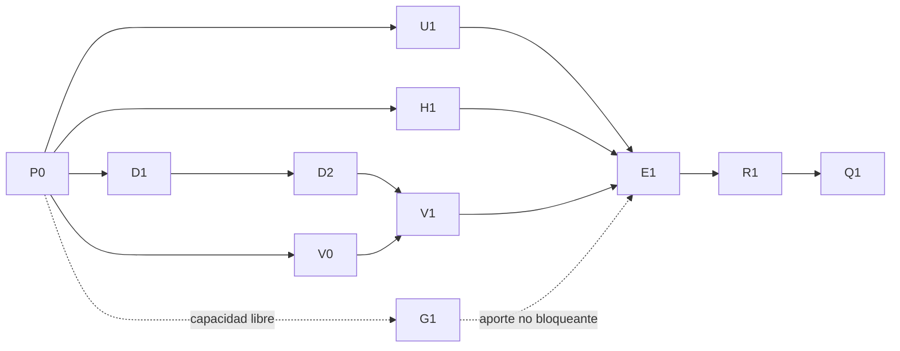

# Plan operativo revisado: héroes, transparencia IA y sensibilidad CASEN

Estado: **en ejecución; consultar el TODO derivado y los recibos del contrato para el avance vigente**.
Fecha: 2026-09-12. Este documento sustituye el plan conversacional anterior.

## Resultado de la revisión

Astra high encontró siete problemas P1 y cuatro P2. Se incorporan al [contrato](contract.json); el [informe](adversarial-review.md) distingue evidencia, riesgo de implementación y correcciones propuestas. Ni la auditoría ni la validez de este contrato prueban que el producto ya cumpla.

Cambio científico principal: CASEN aporta una proporción de **hogares que declaran sitio propio compartido con otras viviendas**, no una tasa observada de viviendas por sitio. Se mantiene la decisión del usuario de usar CASEN aparte de las barras principales. La razón hipotética r₂ no se calcula con esa proporción de hogares.

## Decisiones cerradas

| Frente | Especificación |
|---|---|
| Unidad CASEN | Una jefatura válida por folio; indicador v9=3/4 sobre todos los hogares con respuesta válida. No filtrar por v28 para este estimando. |
| Dominio y ponderación | expr nacional y 16 regiones; expc comunal únicamente descriptivo, n y faltantes visibles, sin rankings ni IC comunales. |
| Varianza | Python Taylor contrastado con fixture manual independiente y Julia en casos aplicables; UPM del diseño completo, singleton sin tratamiento respaldado produce IC ausente. |
| Faltantes | Códigos según libro oficial, ningún missing convertido a cero; mostrar exclusión y cotas incluyendo faltantes. |
| Robustez | Comparar urbano/rural como dominio, no filas eliminadas; documentar composición y precisión. No convertir patrón en explicación causal. |
| Selección | Valparaíso y Viña se muestran como casos exploratorios elegidos tras observar señales previas; no una confirmación prerregistrada. |
| Proxy | R₂=R₁/(1−pᵥ/2) se limita al anexo algebraico, con p hipotético de viviendas y supuesto de pares completos; no insertar p_h ni restar montos. |
| Brecha fiscal | CASEN no participa en su cálculo. Identidad contra snapshot; error preexistente demostrado abre incidente separado y bloquea ese cierre. |
| Censo | Documentar que las fuentes públicas examinadas no incluyen sitio/predio que permita ese enlace; no afirmar que ningún registro institucional lo contenga. |
| Héroes | Conservar aspecto de Avalúos II, un título sobre overlay; diez familias ES/EN según inventario actual. Reusar cuando calidad y procedencia lo permiten. |
| Imagen desconocida | Buscar recibos/declaración, conservar unknown si necesario; no regenerar automáticamente para fingir procedencia conocida. |
| Atribución | Artículo histórico some_ai por declaración del autor; componentes separados. Texto no revisado conserva unknown si falta evidencia específica. |
| Texto visible | «IA asistida» en artículo; «Hecho con IA · Ver detalles» solo para imagen de origen IA conocido. Variante desconocida dice «Procedencia no documentada · Ver detalles». |
| Catálogo | Ampliar _data/visuales existente; una entrada por tema, sin segundo catálogo contradictorio. |
| Gráfico | Matplotlib para estáticos; ECharts actual en visor. Escenarios anidados no etiquetados como viviendas omitidas observadas. |
| Herramientas | Recuadro Python columnar/geomática, mencionando R/Julia si intervienen; no afirmar ejecución HPC sin evidencia. |
| Fechas y publicación | Mantener fechas, slugs, permalinks y títulos convencionales; cierre en commits locales, sin push ni notificaciones externas. |

## Reparto y dependencias

| ID | Responsable/proveedor | Entrega | Dependencias |
|---|---|---|---|
| P0 | Root / OpenAI | Snapshot de fuentes, repos, inventario, rutas y pruebas baseline. | — |
| D1 | Subagente de datos / OpenAI | Extractor y agregados CASEN, estimador y pruebas de diseño. | P0 |
| U1 | Subagente web / OpenAI | Héroe responsive, declaración IA, política y transformación DEV offline. | P0 |
| H1 | Root + ImageGen / OpenAI | Selección de imágenes, variantes y manifiestos por tema. | P0 para producir; U1 para aceptación final |
| V0 | Subagente de figuras / OpenAI | Estilo Matplotlib y figura de brecha desde snapshot existente. | P0 |
| G1 | Gemini / Google | Contraejemplos documentales sobre fuentes públicas. Complementario. | P0 y capacidad libre |
| D2 | Claude sonnet / Anthropic | Revisión científica de D1 y sus pruebas independientes. | D1 |
| V1 | Mismo subagente de figuras / OpenAI | Figura CASEN con datos científicamente revisados. | D2 y V0 |
| E1 | Root / OpenAI | Única integración de todos los posts, cifras, metadatos y tablas. | D1, U1, H1, V1 |
| R1 | Claude sonnet / Anthropic | Auditoría del candidato integrado, semántica y accesibilidad. | D2 y E1 |
| Q1 | Root / OpenAI | Pruebas finales, revisión de evidencia y commits locales. | R1 |

- Máximo operativo: root y tres trabajadores activos; los procesos CLI también consumen una plaza. Límite de sesión: cinco, sin ocuparlo por defecto.
- D1, U1 y V0 pueden ejecutarse simultáneamente mientras root conduce H1.
- Una sola lectura pesada/proceso analítico y una generación ImageGen a la vez; el resto puede trabajar con fixtures/agregados.
- D2 tiene prioridad sobre G1 al liberar una plaza. La investigación opcional no retrasa la revisión científica.
- E1 construye un artefacto Jekyll fresco y liga su digest a las fuentes antes de validarlo y entregarlo a R1; Q1 reutiliza ese build solo si fuentes y artefacto siguen idénticos.
- Las aceptaciones de revisión D2/R1/G1 son manual_review con informe y comprobación de digest; no se presentan como comandos shell.
- Los modelos Codex de implementación heredan configuración efectiva; no se impone Astra a tareas mecánicas.
- Claude usa alias sonnet explícito; no el default opus del bridge. Se registra lo solicitado y lo observado, sin adivinar versión.
- Gemini exige grupo google explícito para no terminar en Anthropic por fallback automático de Antigravity.
- No se usan Copilot ni LiteLLM por rellenar una matriz: no hay una tarea adicional que justifique su coste/coordination.
- Es una asignación factible basada en dependencias y restricciones; no existe benchmark que demuestre óptimo global entre proveedores.

## Propiedad de archivos y traspasos

El [contrato](contract.json) contiene allowlist por tarea, entradas, salidas, comandos de aceptación, evidencia pendiente y rollback. Los [briefings](briefings/) se generan de ese contrato; no son otra fuente de verdad.

- **Solo E1/root modifica _posts.** U1 entrega componentes, H1 manifiestos e imágenes, D1 agregados, V0/V1 figuras.
- Solo root aplica proyecciones que cruzan repos, cambia el contrato y hace staging/commits.
- D1 escribe exclusivamente bajo v5_brecha del repo analítico; CASEN y el proyecto Julia externo permanecen en lectura.
- No se ejecuta el prepare_sources completo ni el project_fiscal_gap global para un cambio de figura: mezclan transformación, copias, figuras y HTML.
- Solo cada dueño puede modificar su allowlist; una necesidad fuera de alcance se comunica a root, que asigna el archivo antes de editarlo.
- Si aparece otro trabajo concurrente fuera del paquete, se inventaría y preserva; no se exige borrarlo para declarar limpio el scope.
- Un worker no revierte cambios ajenos, no lanza subagentes adicionales sin asignación y no ejecuta git add/commit/push.
- Usar worktree aislado únicamente si un proveedor requiere su propio contexto de escritura; nunca depender de un lock informal para dos escritores del mismo archivo.
- Cada entrega incluye diff/archivos, hash de inputs, comandos y salidas, límites, TODO_STATE y errores. Un cambio posterior invalida la revisión afectada.

### Despacho por proveedor

1. Leer contrato y briefing; revalidar HEAD, fuentes y cuota al ejecutar, no reutilizar el snapshot como estado actual.
2. Para trabajadores nativos, usar spawn_agent con rol implementer y el briefing D1/U1/V0; mantener modelo heredado y contexto mínimo suficiente.
3. Root ejecuta H1 con la skill imagegen integrada; no delega generación a un CLI/API de pago.
4. Preparar el paquete de revisión Claude con diffs relativos, fuentes públicas, agregados y pruebas; excluir microdatos, identificadores, credenciales y rutas personales.
5. Despachar Claude mediante penta-agent/scripts/drop_handoff_for_claude.sh, --from codex --via cli --to-model sonnet --invoke-cli y --file al paquete revisado.
6. El wrapper Claude no garantiza sandbox de solo lectura: ejecutar la revisión en checkout/paquete aislado, comprobar diffs antes/después y no entregarle el árbol canónico como destino de escritura.
7. Para Gemini copiar el briefing público G1 a la queue del state dir permitido y llamar agy-bridge run --caller codex --mode review --timeout 10m --public-export --group google.
8. El state dir del bridge puede fijarse explícitamente a /tmp con AGY_BRIDGE_STATE_DIR si .agents del workspace no es escribible; no eludir permisos ni exportar esa ruta dentro del briefing.
9. Leer result.md y status.json del bridge; validar que el modelo/grupo efectivo conserva Google. Un stdout aparente o self-report solo no demuestra proveedor.
10. Sin Claude disponible, continuar trabajo independiente y QA, dejando revisión científica y cierre pendientes; no sustituirla silenciosamente por otro OpenAI.

### Skills por tarea

- D1: data-science-rsh, estadistica, codigo-multilenguaje, julia-dev para leer/contrastar el estimador y chile-contexto.
- U1: 3cucharadas-site, jekyll-post, codigo-multilenguaje y agent-browser.
- H1: imagegen y las convenciones de 3cucharadas-site; imágenes estadísticas quedan fuera de ImageGen.
- V0/V1: data-science-rsh, codigo-multilenguaje, estadistica y agent-browser para revisar el embed.
- D2/R1: auditoria-critica y estadistica; R1 suma jekyll-post y agent-browser.
- E1/Q1: jekyll-post, 3cucharadas-site, auditoria-critica y handoff-protocol; publicacion-externa solo para piezas locales.
- G1: investigacion-bibliografia, auditoria-critica y chile-contexto, sobre contenido público.
- Recall-context ya consultado: abstención; el trabajo usa contexto de conversación y archivos actuales.
- Paper-search/bibliography-apa se reservan para una laguna bibliográfica real; ya existen fuentes primarias para estas correcciones.
- No se activa normativa-chile salvo introducir una afirmación jurídica nueva; no se inventa infraestructura remota/HPC.
- Playwright local queda como fallback de agent-browser, no una segunda prueba obligatoria que duplique coste.

## Interfaces y compatibilidad

- Agregado CASEN schema_version=1 incluye ámbito/código, unidad y denominador, peso, n válidos/faltantes/positivos, estimación, SE/IC/estado, UPM/estratos/grados de libertad y nota de selección.
- Las 16 regiones y país se exportan con expr; comuna lleva expc, no representativa y CI null. Código geográfico se conserva como string normalizado.
- Inputs inválidos abortan; dato no estimable conserva fila y estado, sin imputar cero. No se ocultan regiones difíciles.
- JSON/CSV/Parquet concuerdan numéricamente; precisión/formato de lectura no modifica datos fuente.
- El catálogo IA permite unknown por componente y distingue declaración autoral, evidencia de herramienta y ausencia de información.
- Niveles: no_ai «Sin IA generativa», some_ai «IA asistida», fully_autonomous «Generado íntegramente con IA», not_disclosed «Sin declaración».
- Para posts futuros ausentes no se hereda some_ai; se muestra not_disclosed. Campos legacy incompatibles provocan error de migración visible.
- Héroe 1600×900 <=250000 bytes y variante 800×450 <=100000; teaser 1280×720 <=180000 y 640×360 <=70000; OG 1200×630 <=180000.
- picture/srcset/sizes y preload deben seleccionar el mismo recurso efectivo; no precargar hero completo además de la variante móvil.
- SVG conserva texto al descargar; la página ofrece tabla HTML, CSV y descripción. No depender del color ni de SVG dentro de img para accesibilidad.

## Aceptación y falsación

| Gate | Evidencia exigida |
|---|---|
| Fuentes | Hash de entrada y snapshot de versión; 218367 personas, 78654 hogares y 77618 viviendas se verifican para ESTA fuente, no se convierten en constantes para futuras bases. |
| Unidad/clave | Fixture conserva hogar único, detecta dos jefaturas, ambigüedad multihogar y join duplicado; falla antes de publicar. |
| Varianza | Cálculo manual, paridad Julia aplicable y fixture singleton; dominio con UPM fuera de región no desaparece. |
| Precisión | Faltantes y n visibles, límites de estimación declarados; ninguna comuna presentada como representativa. |
| No contaminación | Hashes y comparación numérica de brecha/campamentos/materialidad/fiscal y rankings contra baseline; datos CASEN separados. |
| Imágenes | Inspección por par, títulos legibles, contraste 4.5:1 normal/3:1 grande, recurso real descargado y enlaces de atribución. |
| Figura móvil | Textos legibles o navegación/zoom explícito; no reducir 15 etiquetas a tamaño ilegible. |
| Matriz UI | 20 posts × 2 anchos × 2 temas = 80 combinaciones actuales; además archivo, 320px y zoom200% para los títulos más largos. |
| Rendimiento local | Cinco ensayos emparejados cold/warm, baseline/candidato mismo setup; CLS<=0.1, mediana LCP objetivo<=2.5s y regresión no mayor a10%; no afirmar percentiles productivos. |
| Sitio | Build Jekyll producción, verificadores de artefacto/visuales/distribución y tests de componentes afectados. |
| Revisión | P0/P1 resueltos con evidencia; P2 explícitos. Pruebas críticas muestran rojo observado y verde recuperado. |
| Git | Hashes ligados al candidato revisado, diff selectivo, autor/committer correctos, hooks sin envíos externos y commits solo locales. |

Los comandos existentes y futuros están en el contrato. Las pruebas marcadas implementation_required deben construirse durante la tarea; **hoy no están implementadas**. La validación estructural de este plan no se contabiliza como prueba estadística, visual o productiva.

Validación reproducible de este paquete: ejecutar `python3 docs/plans/20260912-heroes-casen/validate_plan.py` desde el blog. Comprueba dependencias, ownership declarado, build previo y tipos de aceptación, y rechaza seis fixtures negativos. El recibo queda en [plan-validation.json](plan-validation.json), con hashes de los documentos; el checker corresponde al snapshot de planificación y no acredita tareas ejecutadas.

## Commits, rollback y límite de alcance

- Primero commit analítico local en catastros_sii: feat(casen): add shared-site household sensitivity.
- Luego commit blog de sistema visual/atribución con sus assets y todos sus consumidores.
- Después commit blog coherente de CASEN, figuras y relato ES/EN; figuras y texto viajan juntos para no dejar publicaciones intermedias contradictorias.
- Conservar historial local existente bf1ff5ac en blog y 93e3dba en analítico; no reset/rebase/push por iniciativa.
- Autor y committer tatan <tatanlabra@gmail.com>, verificados a nivel local y global antes de commit.
- Rollback sobre cambios propios no publicados; fuentes, evidencia y cambios ajenos permanecen. No restaurar todo el repositorio.
- Una mejora fuera del scope queda registrada; una corrección necesaria recibe tarea y gate; un cambio material de método/publicación se consulta por vía nativa.
- Este encargo entrega revisión y planificación materializada. La ejecución del producto, medición de rendimiento y revisión Claude/Gemini quedan pendientes.
